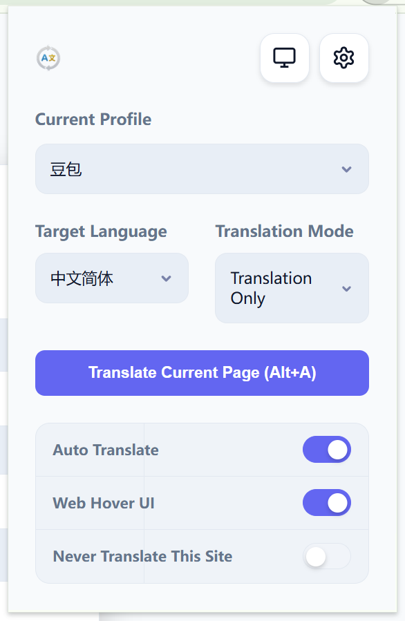
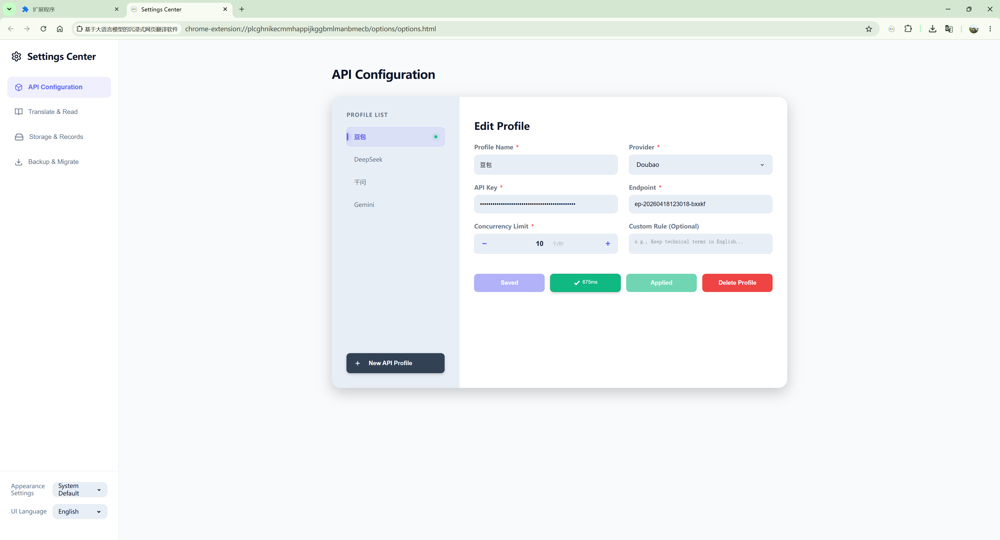
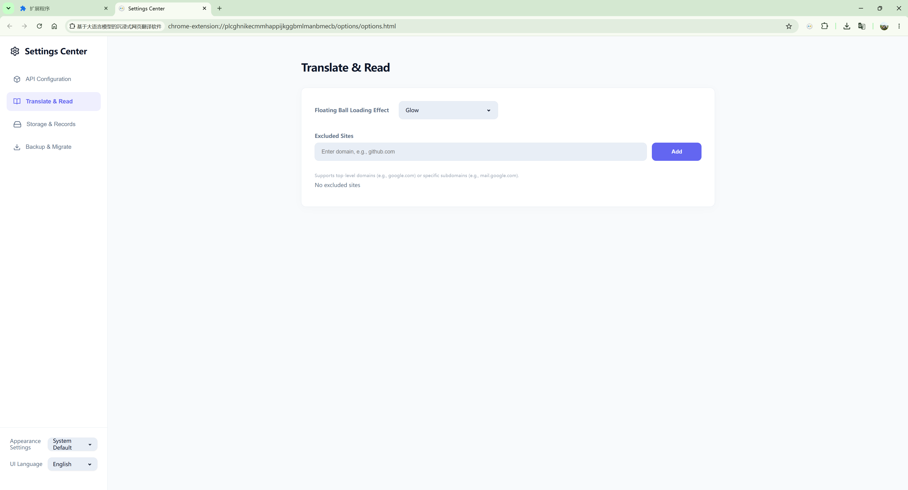
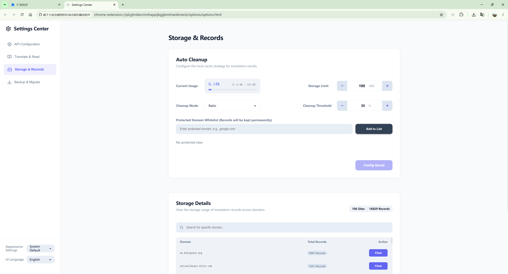
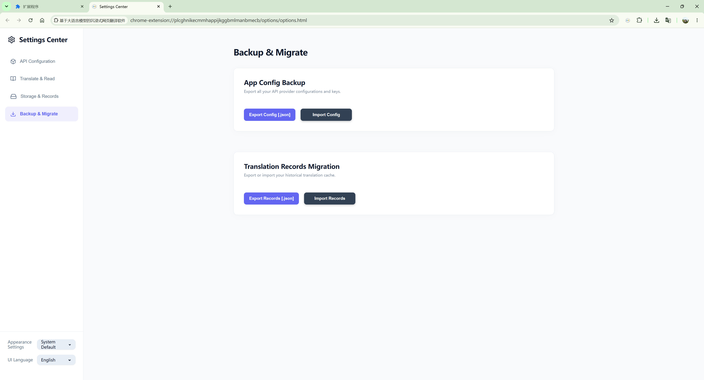

  <a href="../README.md">English</a> |
  <a href="README_zh-CN.md">简体中文</a> |
  <a href="README_zh-TW.md">繁體中文</a> |
  <a href="README_ja.md">日本語</a> |
  <a href="README_ko.md">한국어</a> |
  <a href="README_fr.md">Français</a> |
  <a href="README_de.md">Deutsch</a> |
  <a href="README_es.md">Español</a> |
  <a href="README_ru.md">Русский</a>

<h1 align="center"> Иммерсивное ПО для перевода веб-страниц на базе мультимодальных LLM</h1>

  
  
  

  Расширение для перевода веб-страниц на базе <b>Large Language Models (LLMs)</b>.

---

## 📸 Interface Preview

| Extension Popup | API Configuration |
| :---: | :---: |
|  |  |

| Translate & Read | Storage & Records | Backup & Migrate |
| :---: | :---: | :---: |
|  |  |  |

---

## ✨ Основные функции

  - **🌍 Настоящая интернационализация (i18n)**: Интерфейс полностью адаптирован для 9 основных языков.
  - **Умная кнопка**: Минималистичный дизайн, обеспечивающий обратную связь в реальном времени.

---

## 📜 Лицензия

Этот проект лицензирован по [MIT License](../LICENSE).
