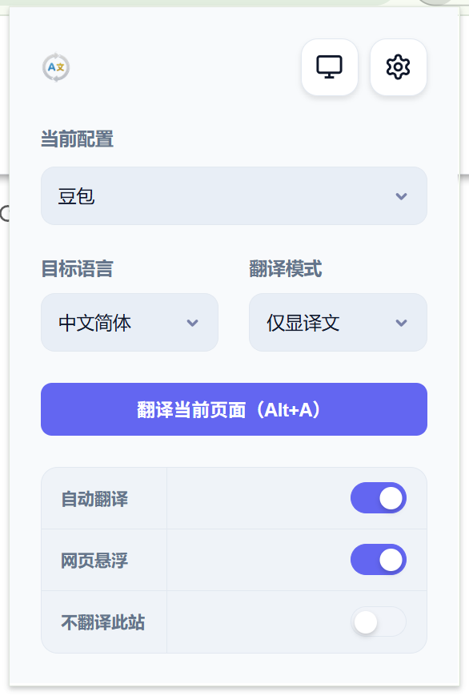
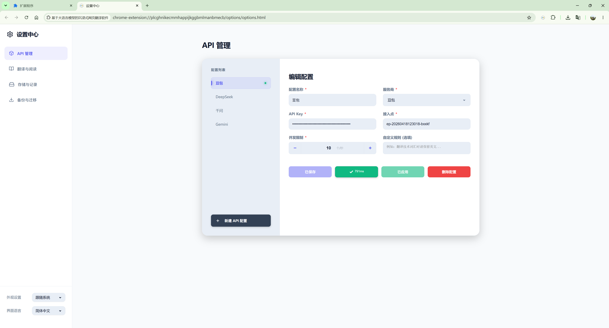
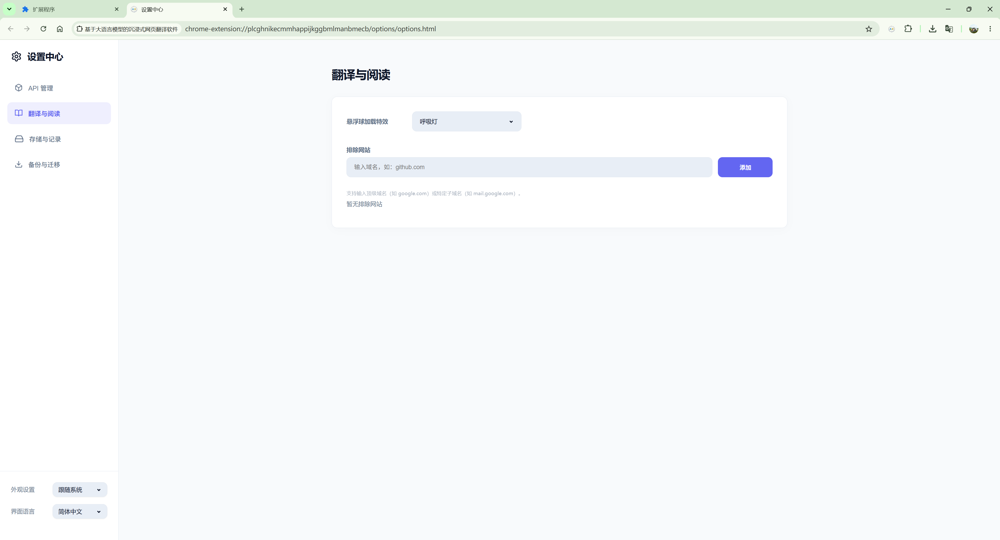
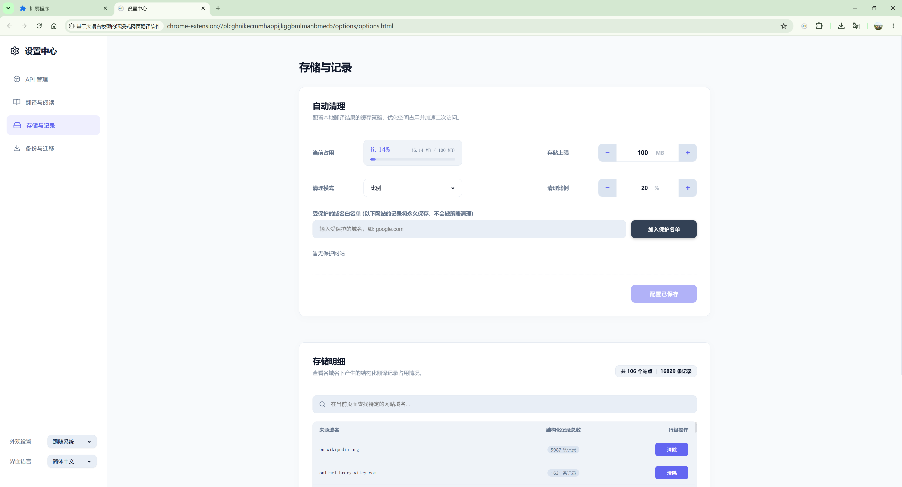
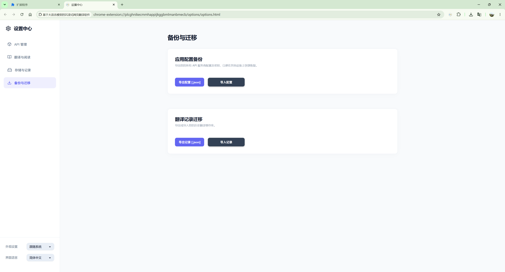

  <a href="../README.md">English</a> |
  <a href="README_zh-CN.md">简体中文</a> |
  <a href="README_zh-TW.md">繁體中文</a> |
  <a href="README_ja.md">日本語</a> |
  <a href="README_ko.md">한국어</a> |
  <a href="README_fr.md">Français</a> |
  <a href="README_de.md">Deutsch</a> |
  <a href="README_es.md">Español</a> |
  <a href="README_ru.md">Русский</a>

<h1 align="center"> 基于大语言模型的沉浸式网页翻译软件</h1>

<i>Immersive Web Translator based on Large Language Models</i>

  
  
  

> [!IMPORTANT]
> **代码公布说明**：本项目完整的源代码、安装脚本与程序包目前正在进行知识产权审查与登记。所有文件将在我们学术论文录用/正式发表后，于本仓库全量开源公布。目前您可以查看[演示视频](#🎥-演示视频)或阅读下方技术文档。

  一款专为开发者和深度阅读者打造的 <b>大语言模型 (LLM)</b> 驱动的网页翻译插件。它不仅提供精准的 AI 翻译，更通过底层渲染优化，实现了接近原生网页的响应速度。

---

## 📸 界面预览

| 插件弹窗 | API 配置 |
| :---: | :---: |
|  |  |

| 阅读与翻译 | 存储与记录 | 备份与迁移 |
| :---: | :---: | :---: |
|  |  |  |

### 🎥 演示视频

  <video src="media/video/Video Project 1.mp4" width="80%" controls>
    您的浏览器不支持 HTML5 视频播放。
  </video>

---

## ✨ 核心特性

- **🚀 极速顺滑翻译**
  - **无感秒翻体验**：消除“原文闪烁”现象，翻译结果如原生网页般自然。
  - **智能请求优化**：基于段落聚合技术，大幅提升翻译速度并节省 API Token。
  - **实时流式打字机**：支持流式输出，翻译结果逐句实时呈现，告别等待。

- **🎨 沉浸式交互体验**
  - **🌍 多语言支持**：面板已适配 9 大语言，根据浏览器设置自动切换。
  - **智能悬浮球**：极简设计，不打扰阅读，实时反馈翻译进度与状态。
  - **网站记忆功能**：智能记忆“显示原文”选项，同站跳转不再反复翻译。
  - **三种展示模式**：提供行间双语、左右分屏、仅显译文，满足快览与精读需求。
  - **译文人工纠错**：右键点击翻译段落即可手动修改，打造完美阅读体验。

- **🛠️ 强悍的网页兼容性**
  - **支持动态网站**：深度适配现代单页应用，滑动或动态加载时翻译不消失、排版不乱。
  - **深度穿透翻译**：支持深入翻译网页内部复杂的隐藏组件（Shadow DOM）。

- **⚙️ 高阶定制与数据资产**
  - **自由接入 LLM**：原生支持 OpenAI 兼容接口，可自由接入各类大模型或部署本地私有模型。
  - **自定义 Prompt**：支持注入自定义翻译规则（如“保留术语”），让 AI 听从个性化指令。
  - **本地缓存省钱**：基于 IndexedDB 的海量缓存，历史页面秒级呈现，零 API Token 消耗。
  - **配置数据迁移**：支持 API 密钥、配置及翻译记录的一键打包备份与无缝还原。

---

## 🛠️ 快速开始

- **1. 安装扩展**

  - **Chrome / Edge 等 Chromium 浏览器**：
    1. 双击项目根目录下的 [use-chrome-manifest.bat](use-chrome-manifest.bat) 切换为 Chromium 版本的配置。 *(Mac / Linux 用户请手动将 `manifest.chrome.json` 覆盖为 `manifest.json`)*
    2. 在浏览器地址栏打开 `chrome://extensions/` 并开启“开发者模式”。
    3. 点击“加载已解压的扩展程序”，选择本项目根目录。
  - **Firefox 浏览器**：
    1. 双击项目根目录下的 [use-firefox-manifest.bat](use-firefox-manifest.bat) 切换为 Firefox 版本的配置。 *(Mac / Linux 用户请手动将 `manifest.firefox.json` 覆盖为 `manifest.json`)*
    2. 在浏览器地址栏输入并访问 `about:debugging#/runtime/this-firefox`。
    3. 点击右侧的 **“Load Temporary Add-on...” (载入临时附加组件)**。
    4. 在弹出的文件选择器中选择本项目根目录下的 `manifest.json`。
  - **Safari 浏览器**：你可以通过 macOS 终端运行 `xcrun safari-web-extension-converter /path/to/project` 将其转换为 Xcode 工程并在 Safari 中载入，也可以在 Safari 开发者菜单中勾选加载未签名扩展。

- **2. 配置 API**

  - 点击插件图标进入设置。
  - 填入你的 LLM API 配置（如：火山引擎/豆包、OpenAI 兼容接口等）。
  - 选择目标语言（默认：简体中文）。

- **3. 开始阅读**

  - **自动翻译**：系统会根据你的语种偏好自动触发。
  - **手动控制**：通过右键菜单或点击悬浮球随时切换。

---

## 🏗️ 技术架构

关于本插件详细的底层架构设计与渲染优化算法，请参阅我们的学术论文：📄 **[点击阅读论文](https://#)**

---

## 📜 开源协议

本项目采用 [MIT License](../LICENSE) 协议。
