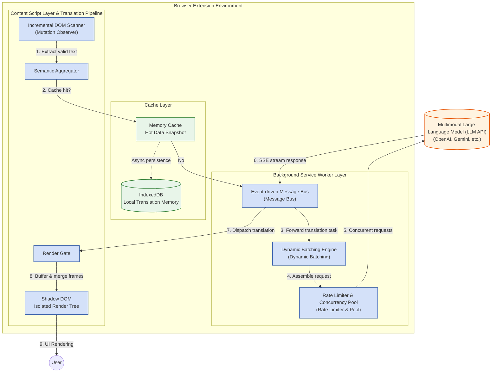

```mermaid
graph TD
    classDef layerBox fill:#f9f9f9,stroke:#333,stroke-width:2px,stroke-dasharray: 5 5
    classDef coreComponent fill:#d4e1f9,stroke:#2852a3,stroke-width:1.5px
    classDef dataStore fill:#e8f5e9,stroke:#2e7d32,stroke-width:1.5px
    classDef external fill:#fff3e0,stroke:#e65100,stroke-width:1.5px

    LLM[("Multimodal Large Language Model (LLM API)<br/>(OpenAI, Gemini, etc.)")]:::external
    
    subgraph "Browser Extension Environment"
        subgraph "Cache Layer"
            IndexedDB[("IndexedDB <br/> Local Translation Memory")]:::dataStore
            MemoryCache["Memory Cache <br/> Hot Data Snapshot"]:::dataStore
        end
        subgraph "Background Service Worker Layer"
            RateLimiter["Rate Limiter & Concurrency Pool<br/>(Rate Limiter & Pool)"]:::coreComponent
            BatchScheduler["Dynamic Batching Engine<br/>(Dynamic Batching)"]:::coreComponent
            MessageBus["Event-driven Message Bus<br/>(Message Bus)"]:::coreComponent
        end
        subgraph "Content Script Layer & Translation Pipeline"
            DOMScanner["Incremental DOM Scanner<br/>(Mutation Observer)"]:::coreComponent
            SemanticAggregator["Semantic Aggregator"]:::coreComponent
            RenderGate["Render Gate"]:::coreComponent
            ShadowDOM["Shadow DOM <br/> Isolated Render Tree"]:::coreComponent
        end
    end

    DOMScanner -- 1. Extract valid text --> SemanticAggregator
    SemanticAggregator -- 2. Cache hit? --> MemoryCache
    MemoryCache -- No --> MessageBus
    MessageBus -- 3. Forward translation task --> BatchScheduler
    BatchScheduler -- 4. Assemble request --> RateLimiter
    RateLimiter -- 5. Concurrent requests --> LLM
    LLM -- 6. SSE stream response --> MessageBus
    MessageBus -- 7. Dispatch translation --> RenderGate
    RenderGate -- 8. Buffer & merge frames --> ShadowDOM
    ShadowDOM -- 9. UI Rendering --> User((User))
    MemoryCache -. Async persistence .-> IndexedDB
```
