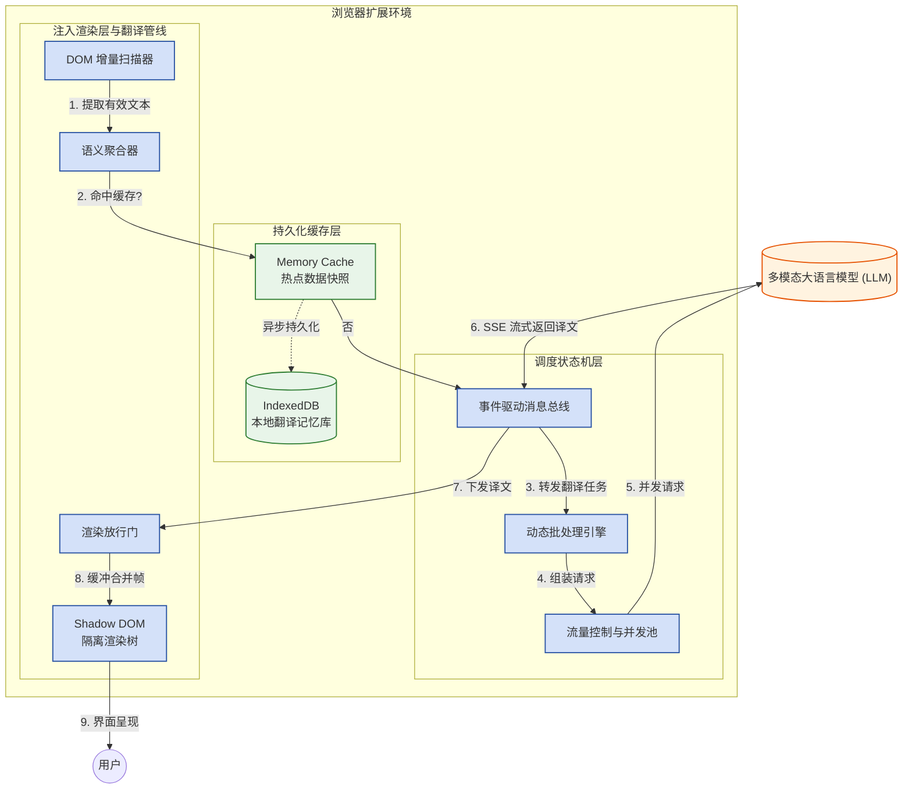

```mermaid
graph TD
    classDef layerBox fill:#f9f9f9,stroke:#333,stroke-width:2px,stroke-dasharray: 5 5
    classDef coreComponent fill:#d4e1f9,stroke:#2852a3,stroke-width:1.5px
    classDef dataStore fill:#e8f5e9,stroke:#2e7d32,stroke-width:1.5px
    classDef external fill:#fff3e0,stroke:#e65100,stroke-width:1.5px

    LLM[("多模态大语言模型 (LLM)")]:::external
    
    subgraph "浏览器扩展环境"
        subgraph "持久化缓存层"
            IndexedDB[("IndexedDB <br/> 本地翻译记忆库")]:::dataStore
            MemoryCache["Memory Cache <br/> 热点数据快照"]:::dataStore
        end
        subgraph "调度状态机层"
            RateLimiter["流量控制与并发池"]:::coreComponent
            BatchScheduler["动态批处理引擎"]:::coreComponent
            MessageBus["事件驱动消息总线"]:::coreComponent
        end
        subgraph "注入渲染层与翻译管线"
            DOMScanner["DOM 增量扫描器"]:::coreComponent
            SemanticAggregator["语义聚合器"]:::coreComponent
            RenderGate["渲染放行门"]:::coreComponent
            ShadowDOM["Shadow DOM <br/> 隔离渲染树"]:::coreComponent
        end
    end

    DOMScanner -- 1. 提取有效文本 --> SemanticAggregator
    SemanticAggregator -- 2. 命中缓存? --> MemoryCache
    MemoryCache -- 否 --> MessageBus
    MessageBus -- 3. 转发翻译任务 --> BatchScheduler
    BatchScheduler -- 4. 组装请求 --> RateLimiter
    RateLimiter -- 5. 并发请求 --> LLM
    LLM -- 6. SSE 流式返回译文 --> MessageBus
    MessageBus -- 7. 下发译文 --> RenderGate
    RenderGate -- 8. 缓冲合并帧 --> ShadowDOM
    ShadowDOM -- 9. 界面呈现 --> User((用户))
    MemoryCache -. 异步持久化 .-> IndexedDB
```
