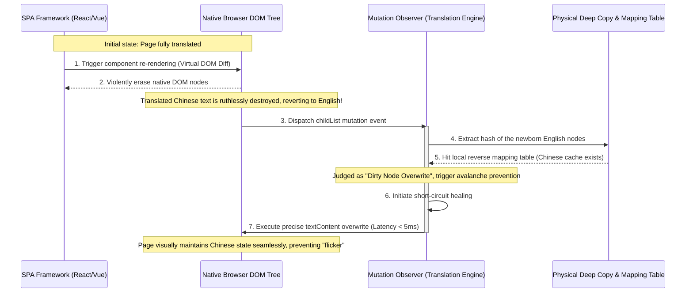

```mermaid
sequenceDiagram
    participant React as SPA Framework (React/Vue)
    participant DOM as Native Browser DOM Tree
    participant Observer as Mutation Observer (Translation Engine)
    participant Shadow as Physical Deep Copy & Mapping Table

    Note over React, DOM: Initial state: Page fully translated
    React->>DOM: 1. Trigger component re-rendering (Virtual DOM Diff)
    DOM-->>React: 2. Violently erase native DOM nodes
    Note over DOM: Translated Chinese text is ruthlessly destroyed, reverting to English!
    
    DOM->>Observer: 3. Dispatch childList mutation event
    activate Observer
    Observer->>Shadow: 4. Extract hash of the newborn English nodes
    Shadow-->>Observer: 5. Hit local reverse mapping table (Chinese cache exists)
    Note over Observer: Judged as "Dirty Node Overwrite", trigger avalanche prevention
    
    Observer->>Observer: 6. Initiate short-circuit healing
    Observer->>DOM: 7. Execute precise textContent overwrite (Latency < 5ms)
    deactivate Observer
    Note over DOM: Page visually maintains Chinese state seamlessly, preventing "flicker"
```
