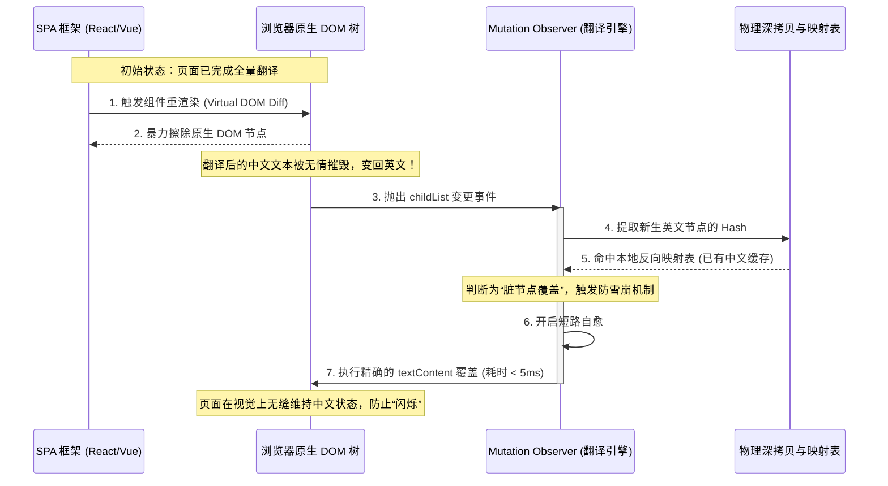

```mermaid
sequenceDiagram
    participant React as SPA 框架 (React/Vue)
    participant DOM as 浏览器原生 DOM 树
    participant Observer as Mutation Observer (翻译引擎)
    participant Shadow as 物理深拷贝与映射表

    Note over React, DOM: 初始状态：页面已完成全量翻译
    React->>DOM: 1. 触发组件重渲染 (Virtual DOM Diff)
    DOM-->>React: 2. 暴力擦除原生 DOM 节点
    Note over DOM: 翻译后的中文文本被无情摧毁，变回英文！
    
    DOM->>Observer: 3. 抛出 childList 变更事件
    activate Observer
    Observer->>Shadow: 4. 提取新生英文节点的 Hash
    Shadow-->>Observer: 5. 命中本地反向映射表 (已有中文缓存)
    Note over Observer: 判断为“脏节点覆盖”，触发防雪崩机制
    
    Observer->>Observer: 6. 开启短路自愈
    Observer->>DOM: 7. 执行精确的 textContent 覆盖 (耗时 < 5ms)
    deactivate Observer
    Note over DOM: 页面在视觉上无缝维持中文状态，防止“闪烁”
```
