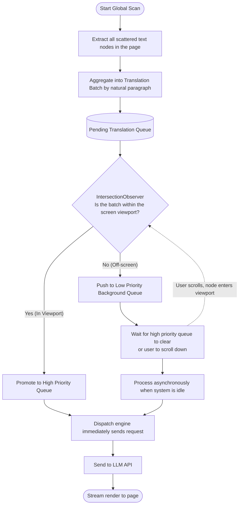

```mermaid
flowchart TD
    Start(["Start Global Scan"]) --> Extract["Extract all scattered text nodes in the page"]
    Extract --> Group["Aggregate into Translation Batch by natural paragraph"]
    Group --> Queue[("Pending Translation Queue")]
    Queue --> IntersectCheck{"IntersectionObserver<br/>Is the batch within the screen viewport?"}
    
    IntersectCheck -- Yes (In Viewport) --> HighPriority["Promote to High Priority Queue"]
    IntersectCheck -- No (Off-screen) --> LowPriority["Push to Low Priority Background Queue"]
    
    HighPriority --> Dispatcher["Dispatch engine immediately sends request"]
    LowPriority --> Wait["Wait for high priority queue to clear<br/>or user to scroll down"]
    
    Wait -. User scrolls, node enters viewport .-> IntersectCheck
    Wait --> IdleDispatch["Process asynchronously when system is idle"]
    
    IdleDispatch --> Dispatcher
    Dispatcher --> Request["Send to LLM API"]
    Request --> End(["Stream render to page"])
```
