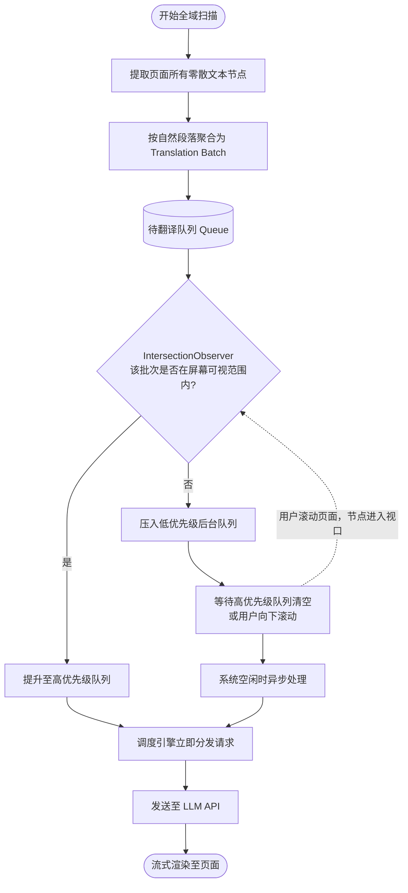

```mermaid
flowchart TD
    Start(["开始全域扫描"]) --> Extract["提取页面所有零散文本节点"]
    Extract --> Group["按自然段落聚合为 Translation Batch"]
    Group --> Queue[("待翻译队列 Queue")]
    Queue --> IntersectCheck{"IntersectionObserver<br/>该批次是否在屏幕可视范围内?"}
    
    IntersectCheck -- 是 --> HighPriority["提升至高优先级队列"]
    IntersectCheck -- 否 --> LowPriority["压入低优先级后台队列"]
    
    HighPriority --> Dispatcher["调度引擎立即分发请求"]
    LowPriority --> Wait["等待高优先级队列清空<br/>或用户向下滚动"]
    
    Wait -. 用户滚动页面，节点进入视口 .-> IntersectCheck
    Wait --> IdleDispatch["系统空闲时异步处理"]
    
    IdleDispatch --> Dispatcher
    Dispatcher --> Request["发送至 LLM API"]
    Request --> End(["流式渲染至页面"])
```
